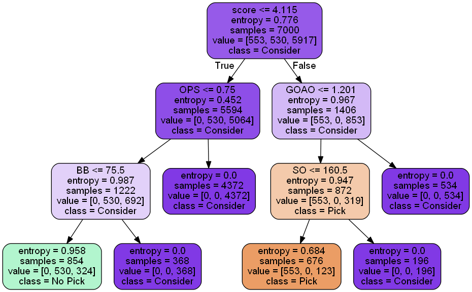
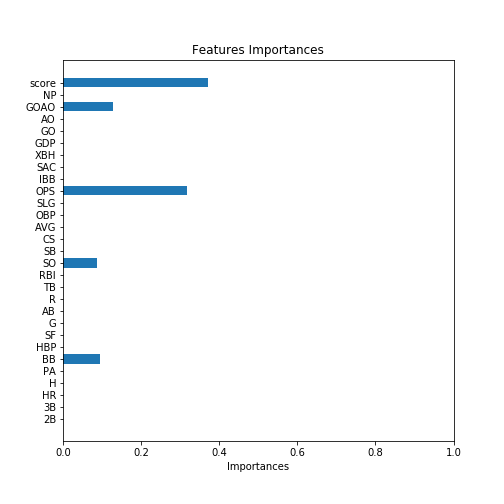
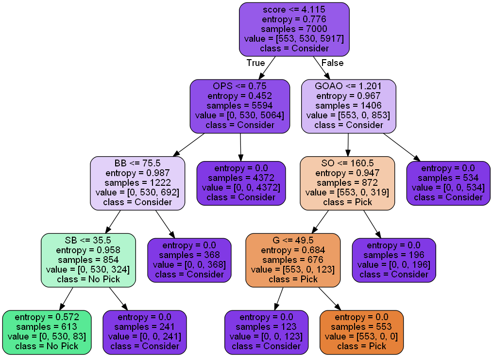
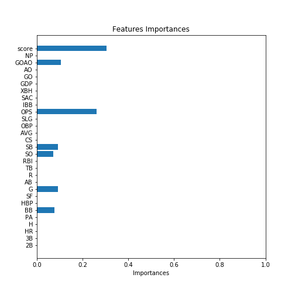

# Using Decision Tree on Baseball Trading 

**The goal of this project**:  Understand what classification systems do and the difference between real behavior of classification model and observed data. Construct a classification model to observe the difference between real ‘right’ data and modeled data.

- Step 1: Design a set of rules to classify data, e.g., classify students with good performance.
  - You should design `k` features/attributes for your problems first.
  - Use ‘absolutely right’ rules to generate your positive and negative data (the number of data = `M`)

- Step 2: Use the data generated in Step 1 to construct your classification model.
  - Decision tree is basic requirement, you can add more classification models.

- Step 3: Compare the rules in the decision tree from Step 2 and the rules you used to generate your ‘right’ data

- Step 4: Discuss anything you can

> For example:
> - Select a good apple
> - Your “absolute right” rule (R)
>   - Color: dark red
>   - Knock voice: sharp
>   - Head color: green
>   - Weight: medium (hidden)
> - Use (R) to generate your data
>   - Add more attributes (20+ is better)
> - Use classifiers to classify your data

## Project Structure

* Dataset and Generator
  * [Data Generator Implementation](program/data_generator.py)
  * [Player Dataset](program/players.csv) (執行 generator 得到)
* Build Classification Model
  * [Decision Tree Implementation](program/decision_tree.ipynb)
  * [Random Forest Implementation](program/random_forest.ipynb)
  * [Naive Bayes Implementation](program/naive_bayes.ipynb)
  * [KNN Implementation](program/knn.ipynb)
  * [SVM Implementation](program/svm.ipynb)

## Report

  * [Report](#report)
  * [Design Rules](#design-rules)
  * [Build Classification Model](#build-classification-model)
    * [Decision Tree](#decision-tree)
    * [Random Forest](#random-forest)
    * [Naive Bayes](#naive-bayes)
    * [k Nearest Neighbors](#k-nearest-neighbors)
    * [Support Vector Machine](#support-vector-machine)
  * [Result Comparison](#result-comparison)
    * [Max Depth = 3 (93.5%)](#max-depth--3-935)
    * [Max Depth = 4 (99%)](#max-depth--4-99)
  * [Discussion](#discussion)

## Design Rules

> Design a set of rules to classify data, e.g., classify students with good performance. 
> * You should design **k** features/attributes for your problems first. 
> * Use ‘**absolutely right**’ rules to generate your positive and negative data (the number of data = **M**)

* 我挑選棒球球員的「野手」資料作為主題
  * 共有 28 個對於打擊成績的主要數據作為 features
* 我希望從符合條件的球員中篩選出三個種類
  1. 目標簽約的球員 (Pick : 0)
  2. 不會簽約的球員 (No Pick : 1)
  3. 考慮簽約的球員 (Consider : 2)
* 以下是 features 的列表，包含解釋、數據範圍、還有我認為的重要性

| Features   | Description                     | Range     | Importance (My perspective) |
| ---------- | ------------------------------- | --------- | --------------------------- |
| G          | 出賽次數                        | [1, 162]  | Medium (50%)                |
| ***AB**    | 打擊次數 (去除成功 BB, HBP, SF) | -         | Low (10%)                   |
| R          | 回本壘得分次數                  | [0, 150]  | Medium (50%)                |
| H          | 安打次數                        | [0, 262]  | High (90%)                  |
| 2B         | 二壘安打次數                    | [0, 60]   | High (60%)                  |
| 3B         | 三壘安打次數                    | [0, 20]   | High (70%)                  |
| HR         | 全壘打次數                      | [0, 60]   | High (80%)                  |
| RBI        | 打點數 (打出的安打得幾分)       | [0, 130]  | High (80%)                  |
| BB         | 保送次數                        | [0, 120]  | High (90%)                  |
| SO         | 被三振次數                      | [0, 200]  | High (Negative) (-90%)      |
| SB         | 盜壘成功次數                    | [0, 50]   | Medium (50%)                |
| CS         | 盜壘失敗次數                    | [0, 10]   | Low (Negative) (-20%)       |
| ***AVG**   | 打擊率 (H/AB)                   | -         | High (90%)                  |
| ***OBP**   | 上壘率 (H+BB)/(AB+BB+SF)        | -         | High (90%)                  |
| ***SLG**   | 長打率 (TB/AB)                  | -         | High (90%)                  |
| ***OPS**   | 整體攻擊指數 (OBP+SLG)          | -         | High (100%)                 |
| IBB        | 被故意保送次數                  | [0, 30]   | Low (10%)                   |
| HBP        | 被觸身球次數                    | [0, 40]   | Low (5%)                    |
| SAC        | 犧牲觸擊成功次數                | [0, 15]   | Low (5%)                    |
| SF         | 高飛犧牲打成功次數              | [0, 15]   | Low (5%)                    |
| ***TB**    | 壘打數 (1B+1, 2B+2, 3B+3, HR+4) | -         | Medium (40%)                |
| ***XBH**   | 長打加總 (2B+3B+HR)             | -         | Medium (40%)                |
| GDP        | 造成雙殺打次數                  | [0, 30]   | Low (Negative) (-20%)       |
| GO         | 打成滾地球出局次數              | [0, 200]  | Low (Negative) (-20%)       |
| AO         | 打成高飛球出局次數              | [0, 220]  | Low (Negative) (-20%)       |
| ***GO/AO** | 滾飛比 (越低表示較能把球打遠)   | -         | High (Negative) (-80%)      |
| NP         | 投手在所有 PA 消耗投手的球數    | [0, 3300] | Medium (50%)                |
| PA         | 打席數 (上場打擊次數，不管結果) | [0, 750]  | Low (20%)                   |

* 有星號的 features 代表是需要依賴別的數據產生的 (dependent)
* 我會將每位選手的所有數值正規化，並乘上 Important 所標註的權重，產生選手的 score
  * 用 Feature scaling 的方式將所有數值正規化
    $$
    x' = \frac{x -\min(x)}{\max(x) - \min(x)}
    $$

* 我定義的 Rules 如下

| My Rules                     | Evaluation | Why                             |
| ---------------------------- | ---------- | ------------------------------- |
| Normalized score $$\ge$$ 80% | Pick       | 我只想先篩選出頂尖 20% 的選手   |
| H > 160                      | Pick       | 安打數越多越好                  |
| AVG > .300                   | Pick       | 打擊率越高越好                  |
| OPS > .750                   | Pick       | 攻擊指數越高越好                |
| BB > 75                      | Pick       | 保送代表會選球                  |
| SB > 35                      | Pick       | 盜壘代表速度快                  |
| Normalized score < 80%       | No Pick    | 不是前 20% 的就暫時不要         |
| GO/AO > 1.2                  | No Pick    | 球打不遠的暫時不要              |
| SO > 160                     | No Pick    | 被三振太多的不會選球，暫時不要  |
| G < 50 or PA < 100           | No Pick    | 出賽、打席過少 (受傷或不被信任) |
| Pick + No Pick               | Consider   | 若有好有壞，就再考慮看看        |

* 其實現實中球員的每項數據間互相都有影響
  * 但這裡不做太細節的處理，只用隨機產生的數據練習
  * 先隨機產生不是星號的 features，再計算出星號的 features
* 接著算出每位選手的 score，並開始 label 各個選手
  * 每一筆便可以依照規則產生 Pick / No Pick / Consider 三種結果
    * 0 : Pick
    * 1 : No Pick
    * 2 : Consider


## Build Classification Model

> Use the data generated in Step 1 to construct your classification model 
>
> * Decision tree is basic requirement, you can add more classification models.

* 我使用 [Scikit-Learn](https://scikit-learn.org/stable/) 作為這次課題的 Framework
  * Scikit-Learn 包含了非常多種傳統 Machine learning 的實作工具
  * 我參考了官方文件並實際操作，記錄了一些實作上的筆記
  * [Scikit-Learn : Introduction](https://sejkai.gitbook.io/academic/python/scikit-learn/introduction)
  * [Scikit-Learn : Statistic Learning](https://sejkai.gitbook.io/academic/python/scikit-learn/statistic_learning)

* 在執行每一種 classifier 之前，要先將資料載入切割成 70/30 的 train/test 比例
  * 用到的是 sklearn 中 model_selection 的 `train_test_split`
* 每一種 classifier 皆內建以下幾個重要的 function
  * `clf.fit(x_train, y_train)`
    * 給定 training set 的 x, y 就可以執行該 classifier 的 training 過程
  * `pred_y = clf.predict(x_test)`
    * 將 test set 的 x 丟給 classifier 的 predict function，就可以產生預測的 y
    * 可以將 `pred_y` 和 `test_y` 對照評估準確率，也可以透過下面的 `score` function 評估
  * `clf.score(x_test, y_test)`
    * 給定 test set 的 x, y 就可以評分該 classifier 在 test 的準確率


### Decision Tree

* `DecisionTreeClassifier` 可以設定非常多的參數
  * `criterion` 是分割所用的方法，可以為 `entropy` 或 `gini`
  * `max_depth` 可以指定樹的深度，若沒有設定該參數，那麼樹將長到所有 leaf 都是 pure 為止
  * 其他還有非常多的參數可以設定
    * `min_samples_split`、`min_samples_leaf`、`max_features`, `max_leaf_nodes` ...
* 以下是產生一個 `DecisionTreeClassifier` 的方法
  * 我使用 Entropy 作為選擇分割的決策方式
  * 並分別測試 max depth 為 3 和 4 的結果

``` python
tree = DecisionTreeClassifier(criterion='entropy', max_depth=3, random_state=0)
```

* `DecisionTreeClassifier` 在 `max_depth = 3` 時準確率為 93.5%
  * 在 `max_depth = 4` 時準確率為 99%


### Random Forest

* 在 scikit-learn 中 Random Forest 可用於 classifier 與 regressor
* `RandomForestClassifier` 可設定的參數與 decision tree 略同
  * 一樣可以指定 `criterion`、`max_depth` 等參數
  * 不一樣的是要設定 `n_estimators` 來決定共要使用幾個 decision tree 來組成 random forest
* 以下是產生 `RandomForestClassifier` 的方法
  * 我使用預設的 `gini` 作為分割決策的方式
  * 產生十個 decision tree 來進行決策
  * 一樣分別測試 max depth 為 3 和 4 的結果

``` python
rf = RandomForestClassifier(n_estimators=10, max_depth=3, random_state=0)
```

* `RandomForestClassifier` 在 `n_estimators=10, max_depth=3` 時準確率 89.5%
  * `n_estimators=10, max_depth=4` 時準確率 90.4%


### Naive Bayes

* scikit-learn 提供 **Gaussian** Naive Bayes 作為 classifier
* `GaussianNB` 可設定參數較少
  * `priors` 可設定 class 的 Prior probabilities
* 以下是產生 `GaussianNB` 的方法
  * 我不使用任何參數，可以直接進行 classification 的動作

``` python
gnb = GaussianNB()
```

* `GaussianNB` 的準確率為 79.8%
  * 在 3000 筆 test 中有 607 筆預測錯誤

### k Nearest Neighbors

* scikit-learn 也提供了 k Nearest Neighbors 的 classifier
* `KNeighborsClassifier` 可以設定 neighbor 數等參數
  * `n_neighbors` 預設為 5 個 nearest neighbors
  * `weights` 給定每個 point 的權重
  * `algorithm` 決定使用 `BallTree`, `KDTree` 或是 `Brute-force`
  * `leaf_size` 用於 balltree 或 kdtree
* 以下是產生 `KNeighborsClassifier` 的方法
  * 我定義 neighbor 數為 10
  * 並採用 kd_tree 作為 knn 的 algorithm

``` python
knn = KNeighborsClassifier(n_neighbors=10, algorithm='kd_tree')
```

* `KNeighborsClassifier` 的準確率為 86.2%
  * 在 3000 筆 test 中有 414 筆預測錯誤


### Support Vector Machine

* scikit-learn 提供 `SVC` 用於 SVM classification
  * 另有 `SVR` 用於 regrssion，有大量 dataset 時則推薦使用 `LinearSVC`
* `SVC` 可以設定很多參數
  * `kernel` 可以是 `linear`, `poly`, `rbf`, `sigmoid`
  * `degree` 用於 kernel 為 poly 的時候
  * `gamma` 則是 kernel 的 coefficient，可以設定 `auto` 以及 `scale`
    * auto 使用 1 / n features
    * scale 使用 1 / (n_features * X.var())
  * 另外還有非常多參數，例如 `cache_size`, `max_iter`, `probability` ...
* 以下是產生 `SVC` 的方法
  * 我使用 rbf 作為 SVM kernel
  * 設定 gamma 為 auto

```
clf = svm.SVC(kernel='rbf', gamma='auto')
```

* `SVC` 的準確率為 85%
  * 在 3000 筆 test 中有 449 筆預測錯誤
* `SVC` 執行速度相對於其他四種方式較慢


## Result Comparison

> Compare the rules in the decision tree from Step 2 and the rules you used to generate your ‘right’ data 

* 以下來討論訓練出來的決策樹及樹中成為決策的重要 features
* 還有決策樹的 rules 和原本的 rules 的差別及產生的誤差在哪裡

### Max Depth = 3 (93.5%)



* 一開始只要是 `score <= 4.115` 的選手就一定不會是 `Pick`
  * 接下來左子樹的不是 `No Pick` 就是 `Consider`
    * `OPS > 0.75` 一定是 `Consider`
    * `OPS <= 0.75` 可能是 `No Pick` 或 `Consider`
      * 接著只要 `BB > 75.5` 就是 `Consider`
      * 而 `BB <= 75.5` 則還是有可能是 `No Pick` 或 `Consider`
  * 右子樹是 `score > 4.115` 的選手，有可能是 `Pick` 或 `Consider`
    * `GOAO > 1.201` 一定是 `Consider`
    * `GOAO <= 1.201` 可能是 `Pick` 或 `Consider`
      * `SO > 160.5` 一定是 `Consider`
      * `SO <= 160.5` 就有可能是 `Pick`，但還是有 123 個 `Consider`

* 總結一下 Max Depth = 3 的 Rules 表格

| Rules                                                        | Evaluation      |
| ------------------------------------------------------------ | --------------- |
| **score** > 4.115 <br>**GOAO** <= 12.01 <br>**SO** <= 160.5  | Pick (81.8%)    |
| **score** <= 4.115 <br> **OPS** <= 0.75 <br> **BB** <=75.5   | No Pick (62%)   |
| **score** <= 4.115 <br> **OPS** > 0.75                       | Consider (100%) |
| **score** <= 4.115 <br> **OPS** <= 0.75 <br> **BB** > 75.5   | Consider (100%) |
| **score** > 4.115 <br> **GOAO** > 1.201                      | Consider (100%) |
| **score** > 4.115 <br> **GOAO** <= 1.201 <br> **SO** > 160.5 | Consider (100%) |

* 發現 Decision Tree 所產生的 Rules 和自己所寫的 Rules 不同之處
  * 我的 Rules 大多可以直接確定 Pick 和 No Pick，只是兩者重疊時要改成 Consider
  * Decision Tree 的 Rules 則是能 100% 直接確定 Consider，但無法準確預測 Pick 與 No Pick
* 另外可以看到 Decision Tree 覺得重要的 features 有
  * score, GOAO, OPS, SO, BB
  * 我所訂的 AVG, SB, G, PA 並沒有被納入重要 features

### Max Depth = 4 (99%)



* Max Depth = 4 時，前 3 層跟原本完全相同
  * 在左子樹方面多了 `SB` 用來更好的拆分 `No Pick` 與 `Consider`
    * `SB > 35.5` 就是 `Consider`
    * `SB <= 35.5` 則有 86.4% 會是 `No Pick`
  * 在右子樹方面多了 `G` 來完美拆分 `Pick` 和 `Consider`
    * `G <= 49.5` 就是 `Consider`
    * `G > 49.5` 就是 `Pick`

* 於是可以多新增四項規則

| Rules                                                                            | Evaluation      |
| -------------------------------------------------------------------------------- | --------------- |
| **score** > 4.115 <br>**GOAO** <= 12.01 <br>**SO** <= 160.5 <br> **G** > 49.5    | Pick (100%)     |
| **score** <= 4.115 <br> **OPS** <= 0.75 <br> **BB** <=75.5 <br> **SB** <= 35.5   | No Pick (86.4%) |
| **score** <= 4.115 <br> **OPS** <= 0.75 <br> **BB** <= 75.5 <br> **SB** > 35.5   | Consider (100%) |
| **score** > 4.115 <br> **GOAO** <= 1.201 <br> **SO** <= 160.5 <br> **G** <= 49.5 | Consider (100%) |

* 雖然 No Pick 的機率還是在 86.4%
  * 但多了一層的 Decision Tree 幫助我找到 100% 為 Pick 的規則
* 重要的 features 多了 SB 和 G
  * 剩下 AVG 跟 PA 沒有被納入重要 features

## Discussion

* 這次的 Project 讓我學習到 scikit-learn 這個 framework
  * 能夠用非常快速及簡單方式來實作傳統 (非 DNN) 的 Machine Learning
  * 並且整合了 NumPy, SciPy, matplotlib 及很多資料分析、拆解的 APIs
* 在 Decision Tree 的部分，Decision Tree 的規則會隨著 data 一起改變
  * 將程式全部重新執行一遍會得到不一樣的 Rules
* 在 `max_depth = 4` 情況下會產生 28 個錯誤
  * 其中全部都是將 `Consider` 誤判為 `No Pick` (2 -> 1)
  * 代表 decision tree 運作的非常良好
    * 能夠分類 100% 的 Pick
      * 其他來自 knn, svm, naive bayes 都會出現將 `Consider` 預測為 `Pick` 的錯誤
    * 所以錯誤應該是來自最左方的 leaf node 所引起的 86.4% `No Pick`
* Decision Tree 用簡單的 entropy 或 gini 算法，就可以為我們解釋分類原因
  * 比起別的 classifier 可以很有效的視覺化結果
  * 今天不了解 features 情況下，還可以告訴我們重要的 features 可能是哪幾個
  * 且可以同時處理 discrete 及 continuous 的 data
